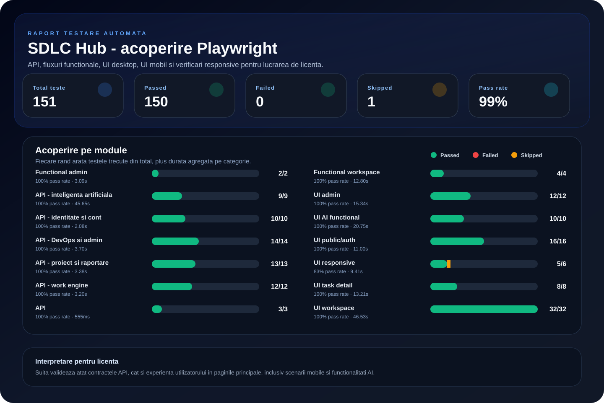
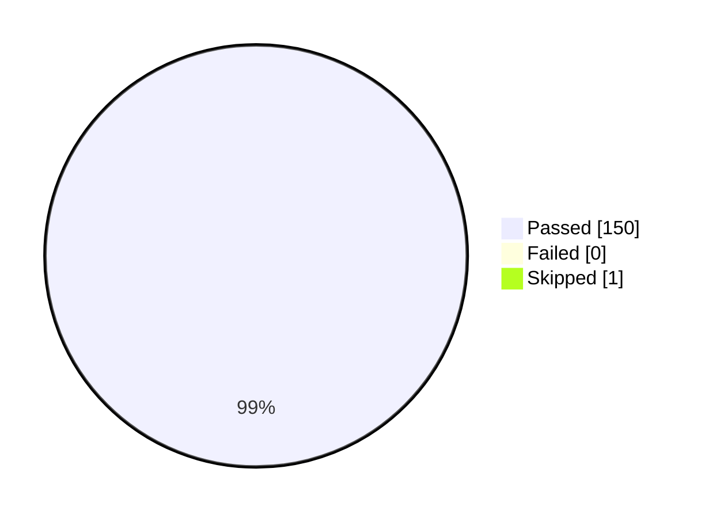
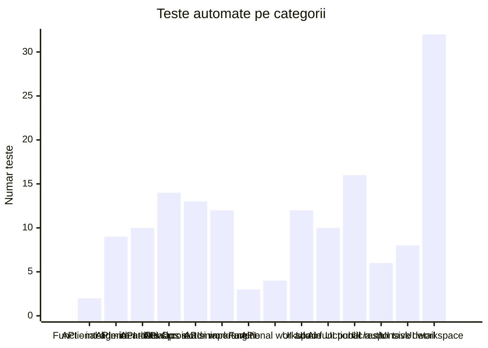

# Raport testare automata Playwright - SDLC Hub

Generat la: 09.07.2026, 09:02:50

## Scop

Acest raport centralizeaza testele automate pentru aplicatia SDLC Hub si poate fi folosit ca material suport in lucrarea de licenta. Testele acopera trei zone:

- testare API pentru autentificare, endpointuri protejate si functii AI;
- testare functionala pentru fluxurile principale din workspace;
- testare UI/responsive pentru layout desktop si mobil.

## Mediu de rulare

| Element | Valoare |
| --- | --- |
| Frontend URL | http://127.0.0.1:3000 |
| Backend API | http://127.0.0.1:8000 |
| Proiecte Playwright | chromium-desktop, chromium-mobile |
| Reporter HTML | `frontend/playwright-report/index.html` |
| Rezultate JSON | `frontend/test-results/playwright-results.json` |

## Rezumat executie

| Total | Passed | Failed | Skipped | Pass rate |
| ---: | ---: | ---: | ---: | ---: |
| 151 | 150 | 0 | 1 | 99% |

## Grafic exportabil pentru lucrare

## Indicatori de calitate

| Indicator | Valoare |
| --- | ---: |
| Durata totala agregata | 190.70s |
| Durata medie per test | 1.26s |
| Categorii acoperite | 14 |
| Browsere/proiecte Playwright | 2 |
| Teste cu rezultat negativ | 0 |

## Grafic rezultat global

## Grafic acoperire pe categorii

## Matrice acoperire pe categorii

| Categorie | Total | Passed | Failed | Skipped | Pass rate | Durata |
| --- | ---: | ---: | ---: | ---: | ---: | ---: |
| Functional admin | 2 | 2 | 0 | 0 | 100% | 3.09s |
| API - inteligenta artificiala | 9 | 9 | 0 | 0 | 100% | 45.65s |
| API - identitate si cont | 10 | 10 | 0 | 0 | 100% | 2.08s |
| API - DevOps si admin | 14 | 14 | 0 | 0 | 100% | 3.70s |
| API - proiect si raportare | 13 | 13 | 0 | 0 | 100% | 3.38s |
| API - work engine | 12 | 12 | 0 | 0 | 100% | 3.20s |
| API | 3 | 3 | 0 | 0 | 100% | 555ms |
| Functional workspace | 4 | 4 | 0 | 0 | 100% | 12.80s |
| UI admin | 12 | 12 | 0 | 0 | 100% | 15.34s |
| UI AI functional | 10 | 10 | 0 | 0 | 100% | 20.75s |
| UI public/auth | 16 | 16 | 0 | 0 | 100% | 11.00s |
| UI responsive | 6 | 5 | 0 | 1 | 83% | 9.41s |
| UI task detail | 8 | 8 | 0 | 0 | 100% | 13.21s |
| UI workspace | 32 | 32 | 0 | 0 | 100% | 46.53s |

## Rezultate pe browser/proiect Playwright

| Browser/proiect | Total | Passed | Failed | Skipped |
| --- | ---: | ---: | ---: | ---: |
| chromium-desktop | 106 | 105 | 0 | 1 |
| chromium-mobile | 45 | 45 | 0 | 0 |

## Acoperire pe categorii

| Categorie | Ce valideaza |
| --- | --- |
| API - inteligenta artificiala | Advisor metodologie, sugestii roluri, generare task, rafinare cerinte, estimare story points, workload AI, provider AI, release notes si documentatie automata |
| API - identitate si cont | Utilizator curent, sumar cont, sesiuni, security log, onboarding, notificari si login invalid |
| API - proiect si raportare | Proiect, membri, roluri, permisiuni, audit, dashboard, reports, workload, AI settings si tranzitie metodologie |
| API - work engine | Tasks board/backlog, task detail, audit task, activity, sprinturi, calendar, disponibilitate, documentatie si echipe |
| API - DevOps si admin | GitHub integration, events, pull requests, ngrok, admin overview, users, projects, tickets, errors si CSV exports |
| Functional workspace | Navigare prin ariile principale si feedback la login invalid |
| UI AI functional | Controale vizuale pentru Spec Refiner, Poker Estimator, Workload Balancer, Project AI provider, Release Notes si documentatie |
| UI workspace | Pagini dashboard, tasks, board, backlog, calendar, activity, workload, reports, documentation, devops, team, support, settings, account si notifications |
| UI task detail | Issue definition, properties, audit log, comments, subtasks si controale |
| UI responsive | Lipsa overflow orizontal, meniu mobil si input cautare Tasks |
| UI admin | Global Admin Console, Identity, Project Registry, Support Desk, AI Usage si System Health |
| UI public/auth | Landing, login, register, forgot/reset/verify email |

## Cele mai lente teste

| Categorie | Proiect browser | Test | Durata |
| --- | --- | --- | ---: |
| API - inteligenta artificiala | chromium-desktop | Workload Balancer genereaza sugestii explicate pentru redistribuire | 17.16s |
| API - inteligenta artificiala | chromium-desktop | Spec Refiner rafineaza cerinte, criterii de acceptare si subtaskuri | 5.92s |
| API - inteligenta artificiala | chromium-desktop | Smart Methodology Advisor recomanda o metodologie pe baza chestionarului | 5.90s |
| Functional workspace | chromium-desktop | incarca dashboardul si navigheaza prin ariile principale | 5.45s |
| Functional workspace | chromium-mobile | incarca dashboardul si navigheaza prin ariile principale | 5.32s |
| API - inteligenta artificiala | chromium-desktop | AI Role Suggestions propune roluri pentru metodologia aleasa | 5.12s |
| API - inteligenta artificiala | chromium-desktop | Release Notes genereaza sumar pentru un sprint existent | 4.33s |
| UI AI functional | chromium-mobile | modalul Create Issue expune generare, rafinare si estimare AI | 3.57s |
| API - inteligenta artificiala | chromium-desktop | Poker Estimator propune story points, incredere si factori de risc | 3.10s |
| UI AI functional | chromium-desktop | modalul Create Issue expune generare, rafinare si estimare AI | 3.06s |

## Rezultate detaliate

| Status | Categorie | Proiect browser | Test | Durata |
| --- | --- | --- | --- | ---: |
| PASS | Functional admin | chromium-desktop | global admin poate deschide consola si sectiunile principale | 1559 ms |
| PASS | Functional admin | chromium-mobile | global admin poate deschide consola si sectiunile principale | 1529 ms |
| PASS | API - inteligenta artificiala | chromium-desktop | Smart Methodology Advisor recomanda o metodologie pe baza chestionarului | 5903 ms |
| PASS | API - inteligenta artificiala | chromium-desktop | AI Role Suggestions propune roluri pentru metodologia aleasa | 5122 ms |
| PASS | API - inteligenta artificiala | chromium-desktop | Spec Refiner genereaza o descriere structurata pentru un task nou | 3048 ms |
| PASS | API - inteligenta artificiala | chromium-desktop | Spec Refiner rafineaza cerinte, criterii de acceptare si subtaskuri | 5925 ms |
| PASS | API - inteligenta artificiala | chromium-desktop | Poker Estimator propune story points, incredere si factori de risc | 3095 ms |
| PASS | API - inteligenta artificiala | chromium-desktop | Workload Balancer genereaza sugestii explicate pentru redistribuire | 17164 ms |
| PASS | API - inteligenta artificiala | chromium-desktop | setarile AI ale proiectului si testul providerului raspund controlat | 778 ms |
| PASS | API - inteligenta artificiala | chromium-desktop | Release Notes genereaza sumar pentru un sprint existent | 4329 ms |
| PASS | API - inteligenta artificiala | chromium-desktop | documentatia automata se poate genera dintr-un task finalizat | 289 ms |
| PASS | API - identitate si cont | chromium-desktop | returneaza utilizatorul autentificat | 260 ms |
| PASS | API - identitate si cont | chromium-desktop | returneaza sumarul contului si proiectele asociate | 261 ms |
| PASS | API - identitate si cont | chromium-desktop | listeaza sesiunile active ale contului | 251 ms |
| PASS | API - identitate si cont | chromium-desktop | listeaza jurnalul de securitate al contului | 270 ms |
| PASS | API - identitate si cont | chromium-desktop | returneaza statusul de onboarding | 252 ms |
| PASS | API - identitate si cont | chromium-desktop | returneaza invitatiile pending ale utilizatorului | 256 ms |
| PASS | API - identitate si cont | chromium-desktop | returneaza notificarile utilizatorului | 261 ms |
| PASS | API - identitate si cont | chromium-desktop | returneaza numarul de notificari necitite | 254 ms |
| PASS | API - identitate si cont | chromium-desktop | respinge login-ul invalid cu 401 sau 400 | 11 ms |
| PASS | API - identitate si cont | chromium-desktop | accepta cererea de resetare parola ca flux controlat | 6 ms |
| PASS | API - DevOps si admin | chromium-desktop | incarca integrarea GitHub a proiectului | 269 ms |
| PASS | API - DevOps si admin | chromium-desktop | incarca evenimentele GitHub ale proiectului | 266 ms |
| PASS | API - DevOps si admin | chromium-desktop | incarca pull request-urile proiectului | 267 ms |
| PASS | API - DevOps si admin | chromium-desktop | incarca statusul ngrok pentru webhook-uri | 257 ms |
| PASS | API - DevOps si admin | chromium-desktop | global admin incarca overview-ul platformei | 267 ms |
| PASS | API - DevOps si admin | chromium-desktop | global admin incarca utilizatorii | 263 ms |
| PASS | API - DevOps si admin | chromium-desktop | global admin incarca proiectele | 263 ms |
| PASS | API - DevOps si admin | chromium-desktop | global admin incarca tichetele de suport | 261 ms |
| PASS | API - DevOps si admin | chromium-desktop | utilizatorul incarca propriile tichete de suport | 257 ms |
| PASS | API - DevOps si admin | chromium-desktop | global admin incarca erorile HTTP capturate | 276 ms |
| PASS | API - DevOps si admin | chromium-desktop | global admin incarca auditul de AI usage | 276 ms |
| PASS | API - DevOps si admin | chromium-desktop | global admin exporta proiectele CSV | 251 ms |
| PASS | API - DevOps si admin | chromium-desktop | global admin exporta utilizatorii CSV | 274 ms |
| PASS | API - DevOps si admin | chromium-desktop | global admin exporta AI usage CSV | 256 ms |
| PASS | API - proiect si raportare | chromium-desktop | incarca detaliile proiectului selectat | 275 ms |
| PASS | API - proiect si raportare | chromium-desktop | incarca membrii proiectului | 277 ms |
| PASS | API - proiect si raportare | chromium-desktop | incarca permisiunile utilizatorului curent in proiect | 257 ms |
| PASS | API - proiect si raportare | chromium-desktop | incarca rolurile proiectului | 259 ms |
| PASS | API - proiect si raportare | chromium-desktop | incarca invitatiile sau refuza controlat accesul | 253 ms |
| PASS | API - proiect si raportare | chromium-desktop | incarca audit log-ul proiectului | 258 ms |
| PASS | API - proiect si raportare | chromium-desktop | incarca sumarul dashboardului | 260 ms |
| PASS | API - proiect si raportare | chromium-desktop | incarca activitatea dashboardului | 262 ms |
| PASS | API - proiect si raportare | chromium-desktop | incarca dashboardul complet al proiectului | 258 ms |
| PASS | API - proiect si raportare | chromium-desktop | incarca overview-ul de rapoarte | 262 ms |
| PASS | API - proiect si raportare | chromium-desktop | incarca workload-ul proiectului | 262 ms |
| PASS | API - proiect si raportare | chromium-desktop | incarca setarile AI ale proiectului | 249 ms |
| PASS | API - proiect si raportare | chromium-desktop | returneaza preview pentru tranzitia metodologiei | 253 ms |
| PASS | API - work engine | chromium-desktop | incarca task-urile pentru board | 265 ms |
| PASS | API - work engine | chromium-desktop | incarca task-urile pentru backlog | 277 ms |
| PASS | API - work engine | chromium-desktop | incarca detaliul primului task disponibil | 281 ms |
| PASS | API - work engine | chromium-desktop | incarca audit log-ul primului task disponibil | 291 ms |
| PASS | API - work engine | chromium-desktop | incarca activitatea proiectului din task engine | 264 ms |
| PASS | API - work engine | chromium-desktop | incarca sprinturile proiectului | 266 ms |
| PASS | API - work engine | chromium-desktop | incarca evenimentele de calendar | 256 ms |
| PASS | API - work engine | chromium-desktop | incarca disponibilitatea membrilor din calendar | 251 ms |
| PASS | API - work engine | chromium-desktop | incarca paginile de documentatie | 259 ms |
| PASS | API - work engine | chromium-desktop | incarca istoricul primei pagini de documentatie daca exista | 271 ms |
| PASS | API - work engine | chromium-desktop | incarca echipele proiectului | 258 ms |
| PASS | API - work engine | chromium-desktop | incarca feed-ul global de activity al proiectului | 258 ms |
| PASS | API | chromium-desktop | respinge accesul anonim pe endpoint protejat | 10 ms |
| PASS | API | chromium-desktop | autentifica utilizatorul si incarca proiectele | 243 ms |
| PASS | API | chromium-desktop | valideaza endpointurile principale pentru proiect | 302 ms |
| PASS | Functional workspace | chromium-desktop | incarca dashboardul si navigheaza prin ariile principale | 5452 ms |
| PASS | Functional workspace | chromium-desktop | pagina de login afiseaza eroare fara refresh distructiv | 760 ms |
| PASS | Functional workspace | chromium-mobile | incarca dashboardul si navigheaza prin ariile principale | 5319 ms |
| PASS | Functional workspace | chromium-mobile | pagina de login afiseaza eroare fara refresh distructiv | 1267 ms |
| PASS | UI admin | chromium-desktop | afiseaza command center si KPI-uri | 1400 ms |
| PASS | UI admin | chromium-desktop | afiseaza sectiunea Identity | 1382 ms |
| PASS | UI admin | chromium-desktop | afiseaza registrul proiectelor | 1236 ms |
| PASS | UI admin | chromium-desktop | afiseaza support desk cu conversatii | 1173 ms |
| PASS | UI admin | chromium-desktop | afiseaza AI usage si filtrele | 1162 ms |
| PASS | UI admin | chromium-desktop | afiseaza system health si inspect pentru erori | 1160 ms |
| PASS | UI admin | chromium-mobile | afiseaza command center si KPI-uri | 1478 ms |
| PASS | UI admin | chromium-mobile | afiseaza sectiunea Identity | 1420 ms |
| PASS | UI admin | chromium-mobile | afiseaza registrul proiectelor | 1274 ms |
| PASS | UI admin | chromium-mobile | afiseaza support desk cu conversatii | 1312 ms |
| PASS | UI admin | chromium-mobile | afiseaza AI usage si filtrele | 1247 ms |
| PASS | UI admin | chromium-mobile | afiseaza system health si inspect pentru erori | 1096 ms |
| PASS | UI AI functional | chromium-desktop | modalul Create Issue expune generare, rafinare si estimare AI | 3056 ms |
| PASS | UI AI functional | chromium-desktop | Workload Balancer afiseaza zona AI si actiunea de generare sugestii | 1866 ms |
| PASS | UI AI functional | chromium-desktop | setarile proiectului includ provider AI local si testarea conexiunii | 1480 ms |
| PASS | UI AI functional | chromium-desktop | rapoartele si backlog-ul expun fluxul de Release Notes asistat de AI | 2515 ms |
| PASS | UI AI functional | chromium-desktop | documentatia arata fluxul de generare automata din taskuri finalizate | 1379 ms |
| PASS | UI AI functional | chromium-mobile | modalul Create Issue expune generare, rafinare si estimare AI | 3573 ms |
| PASS | UI AI functional | chromium-mobile | Workload Balancer afiseaza zona AI si actiunea de generare sugestii | 1631 ms |
| PASS | UI AI functional | chromium-mobile | setarile proiectului includ provider AI local si testarea conexiunii | 1475 ms |
| PASS | UI AI functional | chromium-mobile | rapoartele si backlog-ul expun fluxul de Release Notes asistat de AI | 2467 ms |
| PASS | UI AI functional | chromium-mobile | documentatia arata fluxul de generare automata din taskuri finalizate | 1306 ms |
| PASS | UI public/auth | chromium-desktop | incarca landing page | 652 ms |
| PASS | UI public/auth | chromium-desktop | incarca login | 561 ms |
| PASS | UI public/auth | chromium-desktop | incarca register | 625 ms |
| PASS | UI public/auth | chromium-desktop | incarca forgot password | 588 ms |
| PASS | UI public/auth | chromium-desktop | incarca verify email | 607 ms |
| PASS | UI public/auth | chromium-desktop | incarca reset password | 563 ms |
| PASS | UI public/auth | chromium-desktop | formularul de login permite completare fara blocaj vizual | 642 ms |
| PASS | UI public/auth | chromium-desktop | formularul de register expune campurile principale | 580 ms |
| PASS | UI public/auth | chromium-mobile | incarca landing page | 771 ms |
| PASS | UI public/auth | chromium-mobile | incarca login | 804 ms |
| PASS | UI public/auth | chromium-mobile | incarca register | 819 ms |
| PASS | UI public/auth | chromium-mobile | incarca forgot password | 684 ms |
| PASS | UI public/auth | chromium-mobile | incarca verify email | 718 ms |
| PASS | UI public/auth | chromium-mobile | incarca reset password | 551 ms |
| PASS | UI public/auth | chromium-mobile | formularul de login permite completare fara blocaj vizual | 1126 ms |
| PASS | UI public/auth | chromium-mobile | formularul de register expune campurile principale | 713 ms |
| PASS | UI responsive | chromium-desktop | dashboardul nu produce overflow orizontal | 1122 ms |
| SKIP | UI responsive | chromium-desktop | meniul mobil se deschide si inchide controlat | 210 ms |
| PASS | UI responsive | chromium-desktop | pagina Tasks permite filtrare vizuala fara blocarea inputului | 2522 ms |
| PASS | UI responsive | chromium-mobile | dashboardul nu produce overflow orizontal | 1166 ms |
| PASS | UI responsive | chromium-mobile | meniul mobil se deschide si inchide controlat | 1497 ms |
| PASS | UI responsive | chromium-mobile | pagina Tasks permite filtrare vizuala fara blocarea inputului | 2889 ms |
| PASS | UI task detail | chromium-desktop | incarca pagina de detaliu pentru task | 1640 ms |
| PASS | UI task detail | chromium-desktop | afiseaza zona de comentarii pe task detail | 1626 ms |
| PASS | UI task detail | chromium-desktop | afiseaza subtasks si progress pe task detail | 1643 ms |
| PASS | UI task detail | chromium-desktop | campurile de proprietati sunt accesibile vizual | 1765 ms |
| PASS | UI task detail | chromium-mobile | incarca pagina de detaliu pentru task | 1736 ms |
| PASS | UI task detail | chromium-mobile | afiseaza zona de comentarii pe task detail | 1631 ms |
| PASS | UI task detail | chromium-mobile | afiseaza subtasks si progress pe task detail | 1574 ms |
| PASS | UI task detail | chromium-mobile | campurile de proprietati sunt accesibile vizual | 1595 ms |
| PASS | UI workspace | chromium-desktop | incarca pagina dashboard | 1141 ms |
| PASS | UI workspace | chromium-desktop | incarca pagina tasks | 2609 ms |
| PASS | UI workspace | chromium-desktop | incarca pagina board | 1787 ms |
| PASS | UI workspace | chromium-desktop | incarca pagina backlog | 1390 ms |
| PASS | UI workspace | chromium-desktop | incarca pagina calendar | 1274 ms |
| PASS | UI workspace | chromium-desktop | incarca pagina activity | 1513 ms |
| PASS | UI workspace | chromium-desktop | incarca pagina workload | 1872 ms |
| PASS | UI workspace | chromium-desktop | incarca pagina reports | 1742 ms |
| PASS | UI workspace | chromium-desktop | incarca pagina documentation | 1411 ms |
| PASS | UI workspace | chromium-desktop | incarca pagina devops | 1116 ms |
| PASS | UI workspace | chromium-desktop | incarca pagina pull requests | 1077 ms |
| PASS | UI workspace | chromium-desktop | incarca pagina team | 1475 ms |
| PASS | UI workspace | chromium-desktop | incarca pagina support | 1043 ms |
| PASS | UI workspace | chromium-desktop | incarca pagina settings | 1419 ms |
| PASS | UI workspace | chromium-desktop | incarca pagina account | 1284 ms |
| PASS | UI workspace | chromium-desktop | incarca pagina notifications | 1300 ms |
| PASS | UI workspace | chromium-mobile | incarca pagina dashboard | 1179 ms |
| PASS | UI workspace | chromium-mobile | incarca pagina tasks | 2462 ms |
| PASS | UI workspace | chromium-mobile | incarca pagina board | 1737 ms |
| PASS | UI workspace | chromium-mobile | incarca pagina backlog | 1380 ms |
| PASS | UI workspace | chromium-mobile | incarca pagina calendar | 1335 ms |
| PASS | UI workspace | chromium-mobile | incarca pagina activity | 1513 ms |
| PASS | UI workspace | chromium-mobile | incarca pagina workload | 1611 ms |
| PASS | UI workspace | chromium-mobile | incarca pagina reports | 1717 ms |
| PASS | UI workspace | chromium-mobile | incarca pagina documentation | 1373 ms |
| PASS | UI workspace | chromium-mobile | incarca pagina devops | 1105 ms |
| PASS | UI workspace | chromium-mobile | incarca pagina pull requests | 1102 ms |
| PASS | UI workspace | chromium-mobile | incarca pagina team | 1513 ms |
| PASS | UI workspace | chromium-mobile | incarca pagina support | 1064 ms |
| PASS | UI workspace | chromium-mobile | incarca pagina settings | 1421 ms |
| PASS | UI workspace | chromium-mobile | incarca pagina account | 1333 ms |
| PASS | UI workspace | chromium-mobile | incarca pagina notifications | 1231 ms |

## Erori

Nu au fost raportate erori in executia curenta.

## Observatii pentru lucrarea de licenta

- Testele ruleaza cu date reale de aplicatie, prin contul configurat in `SDLC_TEST_EMAIL` si `SDLC_TEST_PASSWORD`.
- Testele destructive sunt evitate in mod implicit; scopul este validarea stabilitatii fluxurilor principale.
- Pentru defecte vizuale, Playwright pastreaza screenshot/video/trace doar la esec, in `frontend/test-results`.
